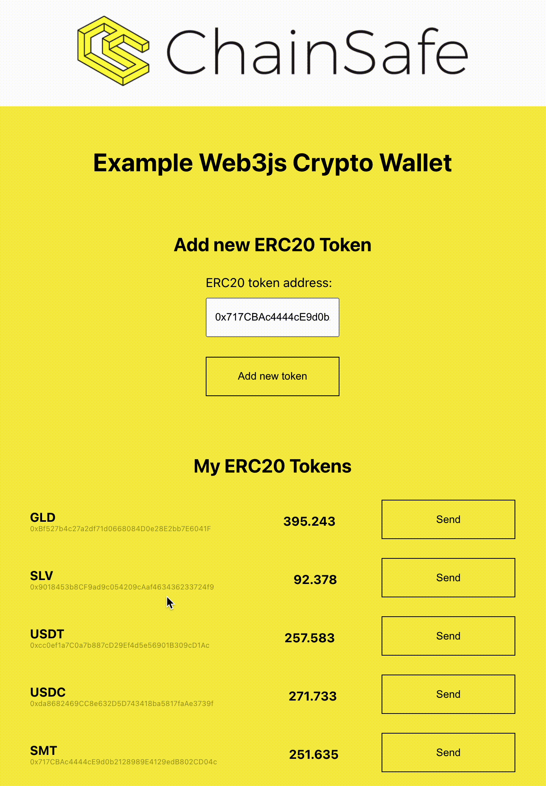

.

# Setup project:
## Install dependencies
```
npm i
```
## Install and run ganache locally
1. Download ganache from official website https://trufflesuite.com/ganache/
2. Open app and run blockchain

## Set environments variables
Get two different private keys from ganache and set them to .env file
REACT_APP_PK=YOUR_FIRST_PRIVATE_KEY
REACT_APP_MAIN_PK=YOUR_SECOND_PRIVATE_KEY

REACT_APP_MAIN_PK - need to deploy ERC20 contracts
REACT_APP_PK - need to add token balances to your wallet

# Run application

```
npm run start
```
Use your REACT_APP_PK to login to your wallet
